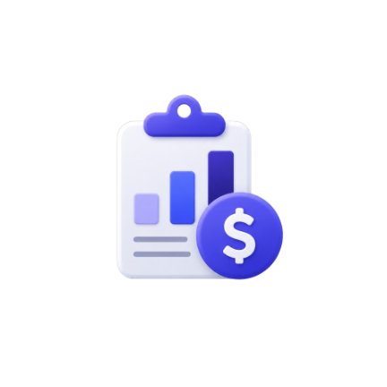
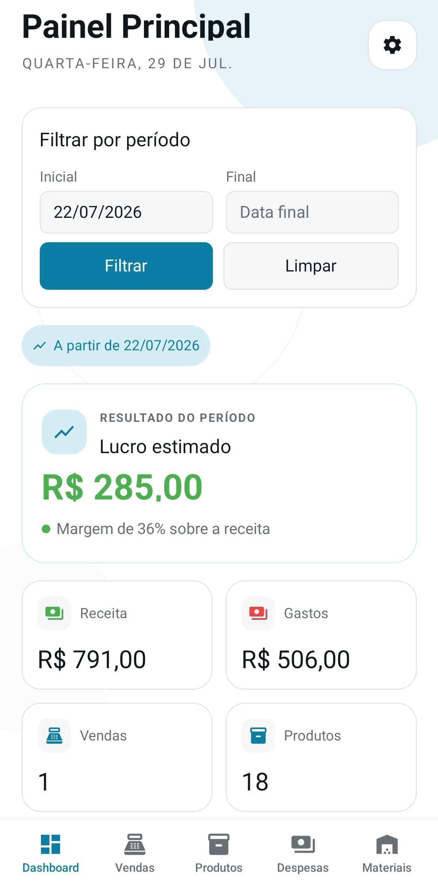
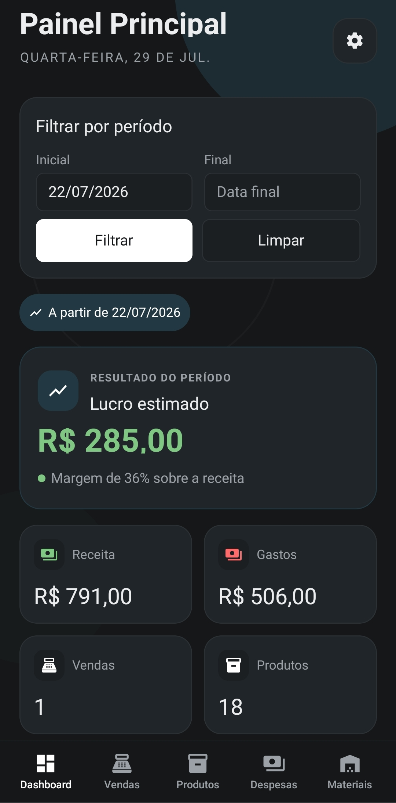
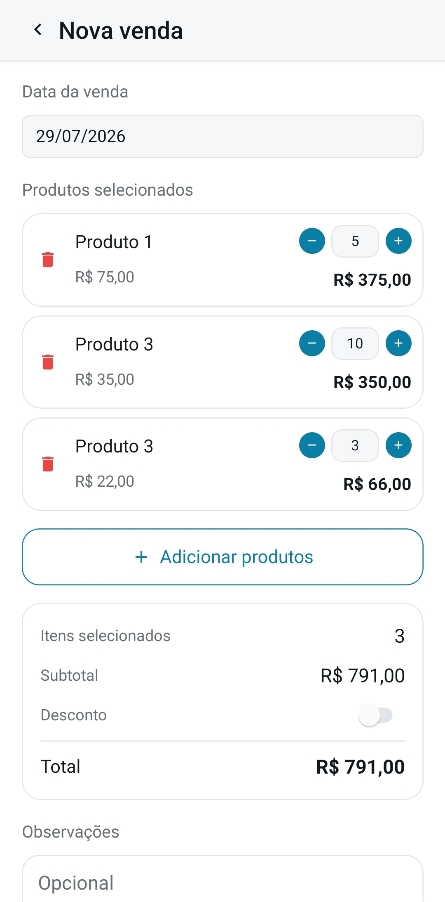
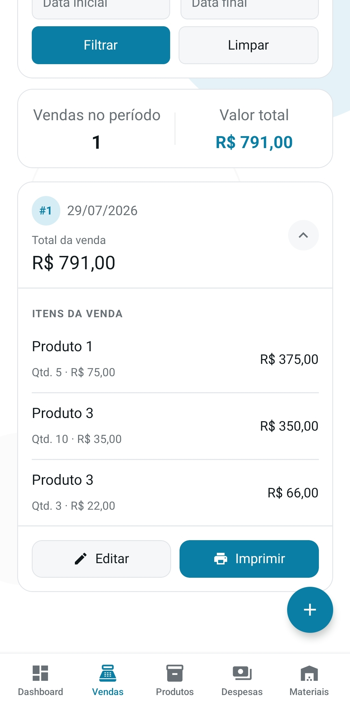
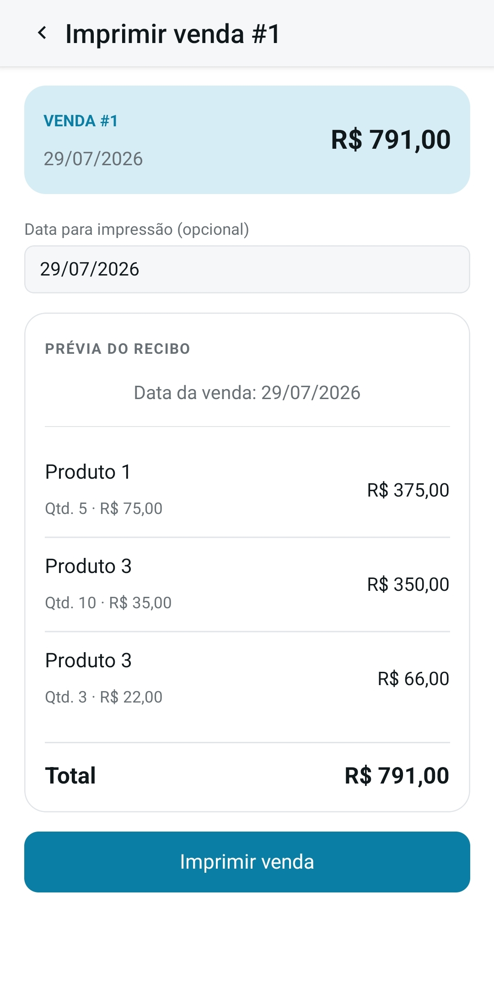
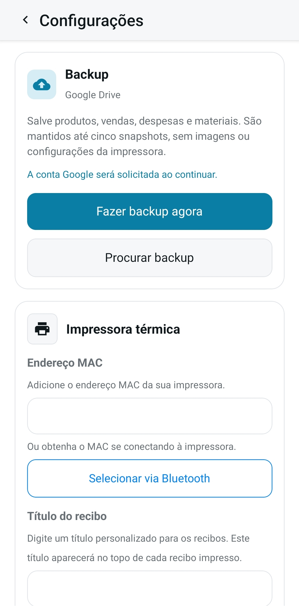

<p align="center">
  
</p>

<h1 align="center">Controle de Vendas</h1>

<p align="center">
  <em>
    Aplicativo mobile para organizar produtos, registrar vendas e despesas,
    acompanhar os resultados do negócio e imprimir recibos.
  </em>
</p>

<p align="center">
  <a href="https://github.com/joaolucenalima/controle-vendas-mobile">
    
  </a>
</p>

## Funcionalidades

### Painel do negócio

Visualize receita, gastos, quantidade de vendas, produtos vendidos, lucro estimado e margem
em um período selecionado. O painel também oferece atalhos para os cadastros mais utilizados
e funciona nos temas claro e escuro.

<p align="center">
  
  &nbsp;&nbsp;
  
</p>

### Produtos, vendas e recibos

Cadastre produtos com nome, preço e imagem, monte uma venda com vários itens e quantidades
e consulte o histórico por período. Depois de concluir uma venda, confira a prévia do recibo
e envie-o para uma impressora térmica Bluetooth configurada no app.

<p align="center">
  
  &nbsp;&nbsp;
  
  &nbsp;&nbsp;
  
</p>

### Despesas e materiais

Registre os materiais usados no negócio, incluindo o preço de referência, e associe um ou
mais materiais às despesas. Esses valores alimentam o resumo financeiro e o cálculo do lucro
estimado no painel.

### Configurações e segurança dos dados

Alterne entre os temas claro, escuro ou automático, conecte uma impressora via Bluetooth e
personalize o título exibido nos recibos. A tela também permite criar e restaurar backups dos
dados comerciais no Google Drive.

<p align="center">
  
</p>

> O backup salva produtos, vendas, despesas e materiais. Imagens dos produtos e configurações
> da impressora não fazem parte do arquivo.

## Como rodar o app

> **Importante:** o projeto utiliza módulos nativos. Por isso, o **Expo Go** pode não executar
> todos os recursos. Para testar o fluxo completo, use um dispositivo Android físico com um
> development build.

### Pré-requisitos

- Node.js e npm;
- Android Studio, com Android SDK e Platform Tools;
- Java 21 (ou Java 17);
- ADB disponível no `PATH`;
- dispositivo Android com a depuração USB habilitada.

### Instalação das dependências

Na raiz do projeto, execute:

```bash
npm install
```

### Execução em desenvolvimento

1. Conecte o celular via USB, autorize a depuração e confirme que ele foi reconhecido:

   ```bash
   adb devices
   ```

2. Compile e instale o development build:

   ```bash
   npx expo run:android
   ```

3. Inicie o servidor Metro:

   ```bash
   npx expo start --dev-client
   ```

4. Abra o aplicativo no celular. As alterações no código serão aplicadas com **Fast Refresh**.

Se o aplicativo não conseguir acessar o Metro pela conexão USB, redirecione a porta:

```bash
adb reverse tcp:8081 tcp:8081
```

## Como instalar no celular

### APK de debug

Gere o APK:

```bash
(cd android && ./gradlew assembleDebug)
```

O arquivo será criado em:

```text
android/app/build/outputs/apk/debug/app-debug.apk
```

Com o celular conectado e autorizado, instale ou atualize o app:

```bash
adb install -r android/app/build/outputs/apk/debug/app-debug.apk
```

Também é possível transferir o APK para o celular, abri-lo pelo gerenciador de arquivos e
autorizar a instalação de apps de fontes desconhecidas quando o Android solicitar.

> O APK de debug é indicado para desenvolvimento e ainda depende do servidor Metro. Para
> distribuir e usar o app sem o computador, gere um APK de release assinado.

### Build de release

Após configurar a assinatura de produção do Android, gere o APK:

```bash
(cd android && ./gradlew assembleRelease)
```

O resultado ficará em:

```text
android/app/build/outputs/apk/release/app-release.apk
```

Para publicação na Google Play, gere um Android App Bundle:

```bash
(cd android && ./gradlew bundleRelease)
```

O AAB será criado em:

```text
android/app/build/outputs/bundle/release/app-release.aab
```

## Problemas comuns

### `Unsupported class file major version 69`

Esse erro ocorre ao utilizar Java 25. Selecione Java 21 ou Java 17 para compilar o projeto.

### O dispositivo não aparece

Verifique se a depuração USB está habilitada, aceite a autorização exibida no celular e execute:

```bash
adb devices
```

